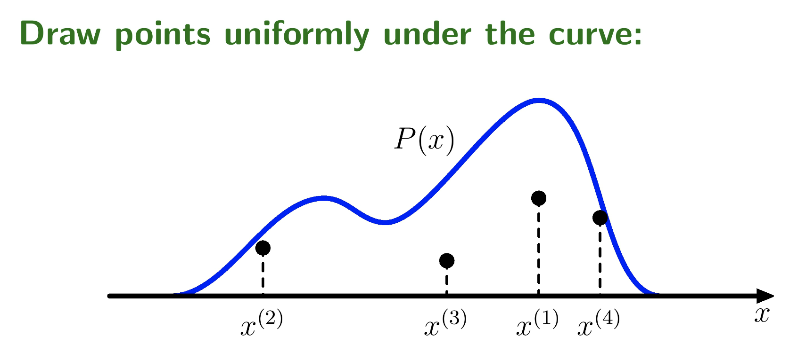
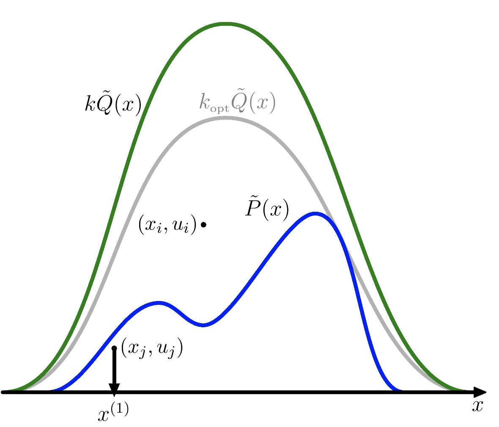
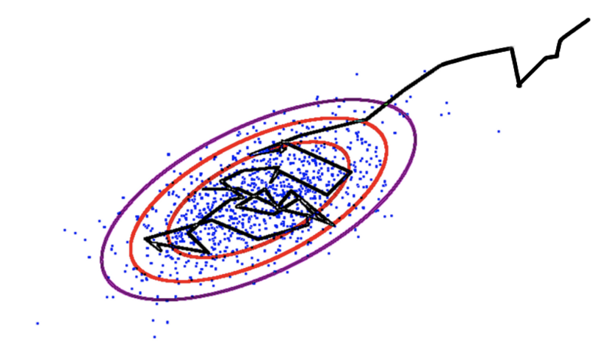

## Markov Chain - Monte Carlo Review

**Monte Carlo simulations** 

* statistical sampling technique

---

**Rejection Sampling** 

* instead of sampling from the blue curve (unknown), use distributions that we know how to sample from (e.g. Gaussian) and check whether the sample is above or below the blue curve. If is below $$\rightarrow$$ keep sample, if above $$\rightarrow$$ reject sample. A bit wasteful because spend lots of time wastime time.

---

**Importance Sampling** 

* trick to sample w/o rejecting too many samples $$\rightarrow$$ divide and multiply integrand by a convenient distribution  
$$ \int f(x)P(x)\partial x =  
\int f(x) \frac{P(x)}{Q(x)} Q(x) dx \approx
\frac{1}{S} \sum_{s=1}^{S} f(x^{(s)}) \frac{P(x^{(s)})}{Q(x^{(s)})}, x^{(s)} \sim Q(x)
 $$ 
 
* for larger problems, we can't use Rejection Sampling or Importance Sampling (can't decompose into low-dimensional conditionals)  
* for example in graphs, conditioning on E we usually don't know P(E) $$\rightarrow$$ normalizing constant :
 $$ P(A,B,C,D|E)=\frac{P(A,B,C,D)}{P(E)} $$
 
**[TODO]** include python code showing how importance sampling works  
1. [Monte Carlo Simulations with Python - Towards Data Science](https://towardsdatascience.com/monte-carlo-simulations-with-python-part-1-f5627b7d60b0)  
2. [Idiap Demo](https://github.com/idiap/importance-sampling)  
3. [Jupyter Notebook 1](https://github.com/kevinzakka/monte-carlo)

---
**Metropolis algorithm** instead of proposing samples independently, proposes small perturbations in the sample we've got previously.  

* similar to gradient descend method $$\rightarrow$$ perturb something, if is better accept, if not reject  

**[TODO]** Metropolis Algorithm in Python

---
**Markov Chain Monte Carlo**

* Key Idea $$\rightarrow$$ we are interested in some probability distribution, we can only evaluate it up to a constant $$\rightarrow$$ construct a random walk that will explore this distribution

  

* On the random walk, follows a Markov Chain $$\rightarrow$$ the next step only depends on previous step and nothing else  
* T $$\rightarrow$$ transition matrix, that allow to go to move to next states - we know the eigenvector and want to construct a vector P that may satisfy it
* Detailed balance $$\rightarrow$$ after some warmup state, the detailed balance states that we can transition from a state to the next or the reversed order with equal probability:  
$$ T(x'\leftarrow x)P^*(x) = T(x\leftarrow x')P^*(x')$$

---
**Metropolis-Hastings**	

* Metropolis invented algorithm in 60's and Hastings (statistician) generalized it  
* Proposed distribution depends on we current are (e.g. add noise to where we currently are now)  
* Show influence of step size $$\sigma$$ $$\rightarrow$$ change rate on how new proposals will be accepted
* Limitations:
	* $$\sigma$$ too large $$\rightarrow$$ many rejections
	* $$\sigma$$ too small $$\rightarrow$$ slow difusion

---
**Gibbs sampling**	

* Method with no rejections
* Moves are constrained to stay on the slice  
* Most popular MCMC method, very easy to implement

**[TODO]** Gibbs sampling in pure Numpy

---
> **_More content to study_**  
> 1. PGM - Probabilistic Graphical Models  
> 2. Variational approximation

---
### Practical
1. [minimc - Collin Carroll](https://github.com/ColCarroll/minimc)
2. [MCMC in PyTorch](https://github.com/mcleonard/pytorch-mcmc/blob/master/PyTorch-MCMC.ipynb)
3. [MCMC in Pyro](http://pyro.ai/examples/mcmc.html)

---
### Sources
1. [Iain Murray Talk - Video Lectures](http://videolectures.net/mlss09uk_murray_mcmc/)
2. [Nando de Freitas - Introduction to MCMC](https://www.cs.ubc.ca/~arnaud/andrieu_defreitas_doucet_jordan_intromontecarlomachinelearning.pdf)
3. [A Conceptual Introduction to Hamiltonian Monte Carlo](https://arxiv.org/abs/1701.02434)